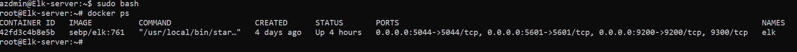

## Automated ELK Stack Deployment

The files in this repository were used to configure the network depicted below.

These files have been tested and used to generate a live ELK deployment on Azure. They can be used to either recreate the entire deployment pictured above. Alternatively, select portions of the yml file may be used to install only certain pieces of it, such as Filebeat.

- **[install-elk.yml](Scripts/install-elk.yml)**
- **[filebeat-playbook.yml](Scripts/filebeat-playbook.yml)**
- **[metricbeat-playbook.yml](Scripts/metricbeat-playbook.yml)**

This document contains the following details:

- Description of the Topologu
- Access Policies
- ELK Configuration
  - Beats in Use
  - Machines Being Monitored
- How to Use the Ansible Build

### Description of the Topology

The main purpose of this network is to expose a load-balanced and monitored instance of DVWA, the D*mn Vulnerable Web Application.

Load balancing ensures that the application will be highly *available*, in addition to restricting *access* to the network.
>- _**Load balancing** is the process of distributing incoming reequests/tasks over a set of resources in order to prevent disproportionate skew of requests load towards one specific server. For example, this can be particularly useful in maintaining availability of services to customers in the setting of a DoS attack on one of the server, rendering it unavailable. If the same services are available on an alternate server, the load balancer can distribute the web traffic to the alternate server when the primary server is 'overloaded' - this way the services (such as sales) continue to remain operational even in the mist of the attack. In addition it can also be configured to limit access to particular servers to prevent penetration by hackers._

Integrating an ELK server allows users to easily monitor the vulnerable VMs for changes to the *logs* and *system metrics*.
>- _**Filebeat** collects data about the file system. It is helpful in detecting changes to certain important files stampd by time like for example if a hacker attemps to change etc/passwd and this information is then sent to Elasticsearch on the ELK Server_
>- _**Metricbeat** Collects metrics to help with the assessment regarding the operational state of computer machines on the network (VMs in this case) and then sends it to Elasticsearch on ELK Server. For example it can be helpful in determining CPU usage, memory disk I/O, Network I/O and Uptime information_

The configuration details of each machine may be found below.
_Note: Use the [Markdown Table Generator](http://www.tablesgenerator.com/markdown_tables) to add/remove values from the table_.

| Name     | Function | IP Address | Operating System |
|----------|----------|------------|------------------|
| Jump-Box | Gateway  | 10.0.0.7   | Linux            |
| Web-1    | Webserver| 10.0.0.8   | Linux            |
| Web-2    | Webserver| 10.0.0.9   | Linux            |
| ELK      |Monitoring| 10.1.0.4   | Linux            |

### Access Policies

The machines on the internal network are not exposed to the public Internet. 

Only the *Jump-Box* machine can accept connections from the Internet. Access to this machine is only allowed from the following IP addresses:
- _*Source IP = public ip of your laptop*_
- _*Destination IP = 10.0.0.4*_
- _*Service = ssh*_
- _*Action = Allow*_

Machines within the network can only be accessed by *Jump-Box*.
- _Only the Jump-Box can connect to Web-1, Web-2, ELK and its IP is 10.0.0.7_

A summary of the access policies in place can be found in the table below.

-**RedTeam_NSG**
| Name                  | Publicly Accessible  | Allowed IP Addresses| Notes         |
|-----------------------|----------------------|---------------------|---------------|
| Allow_SSH_from_laptop | Yes                  | azdmin's Public IP  |               |
| Allow_TCP_to_VN       | Yes, TCP to Web-1,2  | azdmin's Public IP  |               |
| SSH_from_jumpbox      | No, Via Jump-Box     | 10.0.0.1-254        |               |

-**Elk-server-NSG**
| Name                  | Publicly Accessible  | Allowed IP Addresses| Notes         |
|-----------------------|----------------------|---------------------|---------------|
| elk_tcp_5601          | Yes, TCP to port 5601| azdmin's Public IP  |               |
| SSH                   | No, via Jump-Box     | 10.0.0.1-254        |               |

### Elk Configuration

Ansible was used to automate configuration of the ELK machine. No configuration was performed manually, which is advantageous because:
- _TODO: What is the main advantage of automating configuration with Ansible?_

The playbook implements the following tasks:
- _TODO: In 3-5 bullets, explain the steps of the ELK installation play. E.g., install Docker; download image; etc._
- ...
- ...

The following screenshot displays the result of running `docker ps` after successfully configuring the ELK instance.

### Target Machines & Beats
This ELK server is configured to monitor the following machines:
- _TODO: List the IP addresses of the machines you are monitoring_

We have installed the following Beats on these machines:
- _TODO: Specify which Beats you successfully installed_

These Beats allow us to collect the following information from each machine:
- _TODO: In 1-2 sentences, explain what kind of data each beat collects, and provide 1 example of what you expect to see. E.g., `Winlogbeat` collects Windows logs, which we use to track user logon events, etc._

### Using the Playbook
In order to use the playbook, you will need to have an Ansible control node already configured. Assuming you have such a control node provisioned: 

SSH into the control node and follow the steps below:
- Copy the _____ file to _____.
- Update the _____ file to include...
- Run the playbook, and navigate to ____ to check that the installation worked as expected.

_TODO: Answer the following questions to fill in the blanks:_
- _Which file is the playbook? Where do you copy it?_
- _Which file do you update to make Ansible run the playbook on a specific machine? How do I specify which machine to install the ELK server on versus which to install Filebeat on?_
- _Which URL do you navigate to in order to check that the ELK server is running?

_As a **Bonus**, provide the specific commands the user will need to run to download the playbook, update the files, etc._
